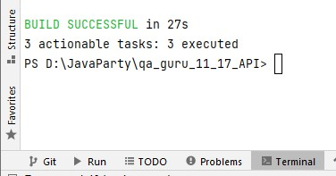

qa_guru_17_API

# Проект по автоматизации тестирования API 
##(mini demo)
:earth_americas: https://reqres.in
В данном demo выполнен пример автоматизации тестирования API с помощью Java.
API взят из публичного источника.

## Содержание:
- [Технологии и инструменты](#watermelon-технологии-и-инструменты)
- [Реализованные проверки](#watermelon-Реализованные-проверки)
- [Запуск из терминала](#watermelon-Запуск-тестов-из-терминала)

## :watermelon: Технологии и инструменты
<p align="center">
<a href="https://www.java.com/"></a>
<a href="https://gradle.org/"></a>
<a href="https://https://rest-assured.io//"></a>
</p>

Перечень технологий и инструментов, использованных при реализации этого проекта:
- Автотесты написаны на языке `Java`
- Для сборки проекта используется `Gradle`
- Java-библиотека для автоматизации тестирования REST-API: `REST Assured`
- Библиотека для проверок `assertThat`

## :watermelon: Реализованные проверки
Примеры API тестов:
- [✓] Регистрация нового пользователя. Статус код 200.
- [✓] Обновить пользователя
- [✓] Пользователь удален (204)
- [✓] Пользователь не найден (404)
- [✓] Вывести response на консоль
- [✓] Проверка текста ответа
- [✓] Проверка времени совершения обновления
- [✓] Проверка создания пользователя с точным временем создания

## :watermelon: Запуск тестов из терминала
Шаги:
1. Открыть терминал
2. Запустить на выполнение команду:
###### Локальный запуск:
```
gradle clean test
```
<p>Результат тестов в терминале:
 
<p>

-------------
P.S. Создание Allure-отчета, удаленный запуск в Jenkins, отправка отчета в Телеграмм-бот, а так же запись видео прохождения тестов в Selenoid в данном мини-проекте не предусмотрены.
<p>ver 2022-05-22